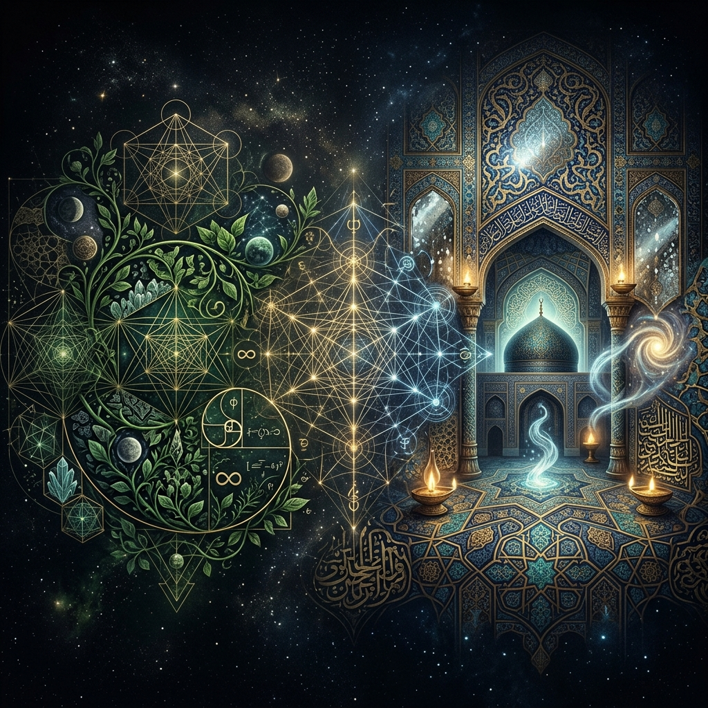

# pantheism-sufism-matrix

[](#) [](#) [](#)

## 🔍 Genel Bakış (Overview)

`pantheism-sufism-matrix`, Batı rasyonalizminin zirve noktalarından biri olan **Panteizm** (Spinozacı Tüz felsefesi) ile İslam düşüncesinin ve irfan geleneğinin en derin deryalarından biri olan **Vahdet-i Vücud** (Şeyh-ül Ekber İbn Arabi ontolojisi) arasındaki farkları ve benzerlikleri inceleyen bir marifet ve analiz deposudur.

Bu çalışma, "Her şey O'dur" (Panteizm) ile "Varlıktan başka bir şey yoktur ve O da Allah'tır" (Vahdet-i Vücud) önermeleri arasındaki o ince ama hayati çizgiyi belirginleştirmeyi hedefler. Bir yanda Tanrı'yı doğaya hapseden natüralist bir bakış, diğer yanda ise tüm kainatı Allah'ın (C.C.) isim ve sıfatlarının birer aynası ve tecellisi olarak gören muazzam bir **Tevhid** anlayışı yer alır.

## 🎯 Hedef Kitle ve Kullanım Amacı

Bu depo; felsefe meraklılarının yanı sıra, Tasavvuf ve İrfan geleneğine ilgi duyan, İslam ontolojisinin (Varlık Bilimi) derinliklerini merak eden müminler ve araştırmacılar için hazırlanmıştır. Amaç, kainatın hakikatini anlamaya çalışırken zihni bulanıklıklardan kurtulmak ve Vahdet-i Vücud gibi ali (yüce) bir meseleyi, Panteizm gibi beşeri felsefelerle karıştırmadan, aslına uygun bir şekilde idrak etmektir.

---

## ⏳ Tarihsel ve Kültürel Bağlam (Two Epochs)

Bu karşılaştırma sadece iki fikrin değil, iki farklı çağın ve coğrafyanın da karşılaşmasıdır:

*   **13. Yüzyıl - İrfan ve Tecelli Çağı:** Şeyh-ül Ekber İbn Arabi Hazretleri, Endülüs'ten Şam'a uzanan yolculuğunda, İslam medeniyetinin zirve noktasında bu doktrini sistemleştirmiştir. O'nun sistemi, Kur'an ve Sünnet'in kalbi yorumu üzerine inşa edilmiş bir "Keşf" medeniyetinin ürünüdür.
*   **17. Yüzyıl - Rasyonalizm ve Aydınlanma Şafağı:** Benedict de Spinoza, modern bilimin ve Kartezyen düşüncenin yükseldiği bir Avrupa'da yaşamıştır. O'nun panteizmi, mistik bir deneyimden ziyade, geometrik bir kesinlikle (*More Geometrico*) ispatlanmaya çalışılan bir mantık kalesidir.

---

## ⚖️ Metodoloji ve Prensipler

Bu çalışmada, hakikat arayışında hem aklın hem de kalbin rehberliği gözetilir:

1.  **Manevi Edep ve İlmi Hakikat:** Cenab-ı Hak ve O'nun ali hakikatleri hakkında konuşurken edep dairesinde kalınır; ancak meseleler mantıksal bir örgü içinde analiz edilir.
2.  **Tevhid Odaklılık:** Tüm analizler, Allah'ın (C.C.) birliği ve benzersizliği (Tenzih) ilkesine halel getirmeyecek şekilde kurgulanır.
3.  **Terminolojik Sadakat:** Sufizm bahsinde "Tanrı" gibi genel ve soğuk terimler yerine **Cenab-ı Hak**, **Allah (C.C.)**, **Zat-ı Bari** ve **Vücud-ı Mutlak** gibi kalbi ve ilmi karşılıklar tercih edilir.

---

## 🧠 Sistemlerin Mimari Kıyaslaması

### İbn Arabi: Katmanlı Varlık (Hazret-i Hams)
Vahdet-i Vücud'da varlık tek katmanlı değildir. Beş Hazret (Varlık Mertebesi) üzerinden bir hiyerarşi izler:
1.  **Zat Alemi (Gayb-ı Mutlak):** Allah'ın (C.C.) bilinmezliği.
2.  **Ceberut:** İsim ve sıfatların alemi.
3.  **Melekût:** Ruhlar ve misal alemi.
4.  **Mülk:** Duyularla algılanan maddi alem.
5.  **İnsan-ı Kamil:** Tüm bu mertebeleri kendinde toplayan en kapsamlı ayna.

### Spinoza: Tek Tüz (Monist Yapı)
Spinoza'nın sistemi ise daha yatay ve tek katmanlıdır:
1.  **Substantia (Tüz):** Tek gerçek varlık (Tanrı veya Doğa).
2.  **Attributes (Sıfatlar):** Tüzün sonsuz sıfatları (Ancak insan sadece *Düşünce* ve *Yer Kaplam*ı bilir).
3.  **Modes (Tavırlar):** Bu sıfatların geçici görünümleri (İnsanlar, eşyalar, fikirler).

---

## 🧩 Karşılaştırmanın Temel Sütunları

### 1. Zahiri Benzerlikler (Common Ground)
*   **Monist Yaklaşım:** Her iki sistem de varlığın parça parça değil, bir bütünlük içinde olduğu fikrinde birleşir.
*   **Allah'ın (C.C.) Yakınlığı:** "O, her şeye şah damarından daha yakındır" hakikatinin zahiri bir yorumu gibi duran içkinlik vurgusu.

### 2. Hayati Farklar: Tenzih ve İrade
*   **Münezzehiyet:** İslam irfanında Allah (C.C.) kainatın içinde tecelli eder ama kainattan sonsuz derece üstündür (**Tanzih**). Panteizmde ise Tanrı doğanın kendisidir ve doğanın dışı yoktur.
*   **İlahi İrade:** Spinoza'da Tanrı bir "karar" vermez, sadece kendi doğasının gereğini yaşar. İslam irfanında ise Allah (C.C.) **Mürid**'dir; her şeyi dilediği gibi ve bir hikmetle yaratır.

---

## 🔮 Arketipler Teorisi: Ayan-ı Sabite
Vahdet-i Vücud'u Panteizm'den ayıran en büyük teknik baraj **Ayan-ı Sabite**'dir. Bunlar, eşyanın henüz yaratılmadan önce Allah'ın ezeli ilminde sabit olan hakikatleridir. Bu katman sayesinde İslam ontolojisi, Panteizm'deki "Allah'ın maddeleşmesi" tehlikesinden kurtulur. Her şey O'nun ilmindeki birer surettir; madde ise bu ilmi suretlerin nur ile dış dünyada görünür hale gelmesidir.

---

## 📊 Karşılaştırma Matrisi (Manevi ve İlmi Perspektif)

| Parametre | Panteizm (Spinozacı Bakış) | Vahdet-i Vücud (İrfani Bakış) |
| :--- | :--- | :--- |
| **Varlık İlişkisi** | Tanrı = Doğa (Aynılık) | Alem, Allah'ın tecellisidir (Yansıma) |
| **Uluhiyetin Makamı** | Doğaya hapsedilmiş | Hem içkin (Tecelli) hem Aşkın (Zat) |
| **İrade ve Şuur** | Yoktur (Mekanik işleyiş) | Vardır (Mürid ve Hakim olan Allah) |
| **Maddeye Bakış** | Hakiki ve sonsuz madde | İzafi, geçici ve "hayali" varlık |
| **Bilgiye Ulaşım** | Sadece Akıl ve Mantık | Akıl + Kalp (Keşf ve Şuhud) |
| **Özgürlük Anlayışı** | Zorunluluğu kabul | Allah'a tam teslimiyet (Ubudiyet) |

---

## 🖼️ Görsel Modellerin İzahı

Bu depodaki diyagramlar, meseleyi zihinde somutlaştırmak içindir:

1.  **Panteizm Modeli (`pantheism_flow.png`):** Tanrı'nın doğa yasaları içinde nasıl "eridiğini" ve sınırlandığını temsil eder.
2.  **Yansıma Modeli (`sufism_reflection.png`):** Allah'ın (C.C.) Zat'ının kainattan münezzeh oluşunu, kainatın ise O'nun nurunun bir aynadaki yansıması (Gölge) oluşunu betimler.

---

## ⚠️ Dikkat Edilmesi Gereken Hususlar

*   **"Vahdet-i Vücud Panteizm Değildir":** Bu bir inanç meselesidir. Panteizm ateizme komşudur; Vahdet-i Vücud ise "Lâ mevcûde illâllah" (Allah'tan başka gerçek varlık yoktur) diyerek en yüksek Tevhid mertebesine ulaşır.
*   **Şeriat ve Hakikat:** Vahdet-i Vücud ehli, şeriatın zahiri hükümlerine her zaman bağlı kalmış, hakikati bu hükümlerin özü olarak görmüştür.
*   **Hulul ve İttihat Reddi:** İslam irfanı, Allah'ın bir şeye girmesini (Hulul) veya bir şeyle birleşmesini (İttihat) reddeder. Her şey sadece bir tecellidir.

---

## 📙 Teknik Terimler Sözlüğü (Glossary)

*   **Vücud-ı Mutlak:** Hiçbir sınırla kayıtlı olmayan mutlak varlık (Allah C.C.).
*   **Tenzih:** Allah'ın (C.C.) yaratılmış olan hiçbir şeye benzememesi, her şeyden yüce olması.
*   **Tecelli:** Allah'ın nurunun, isim ve sıfatlarının kainat aynasında görünmesi.
*   **Substantia (Tüz):** Var olmak için başka hiçbir şeye ihtiyaç duymayan tekil gerçeklik.
*   **Araz:** Kendi başına var olamayan, ancak bir tüzde veya tecellide görünebilen geçici özellikler.

---

## 📚 Temel Kaynakça (Primary Sources)

1.  **Şeyh-ül Ekber İbn Arabi:** *Fusus'ul Hikem* (Hikmetlerin Özü) ve *Futuhat-ı Mekkiyye*.
2.  **Benedict de Spinoza:** *Ethics* (Ethica - Geometrik Düzenle İspatlanmış Ahlak).
3.  **Toshihiko Izutsu:** *Sufism and Taoism* (Karşılaştırmalı ontoloji çalışmaları için klasik bir eser).

---

## 📂 Depo Yapısı (Repository Structure)

```text
pantheism-sufism-matrix/
├── README.md                      # Proje manifestosu ve ana rehber
├── docs/
│   ├── 01_core_similarities.md    # Tezahür ve Monizm kesişimleri
│   ├── 02_core_conflicts.md       # Tenzih, İrade ve Yaratılış sırları
│   ├── 03_archetypes_theory.md    # Ayan-ı Sabite ve İlahi İlim
│   ├── 04_spinoza_vs_arabi.md     # Spinoza (Tüz) vs. Şeyh-ül Ekber (Zat)
├── data/
│   ├── comparative_matrix.csv     # Ham veri ve teknik tablo
├── diagrams/
    ├── pantheism_flow.png         # Panteistik varlık akış diyagramı
    ├── sufism_reflection.png      # Vahdet-i Vücud yansıma (gölge) modeli
```

## 🤝 Katkıda Bulunma (Contributing)

Bu ilmi çalışmaya katkıda bulunmak isterseniz:
1.  Lütfen **edep ve akademik ciddiyet** çerçevesinde hareket edin.
2.  Eklemelerinizi kaynak (Ayet, Hadis veya Şarihlerin eserleri) belirterek yapın.
3.  Pull Request açarken meseleyi hangi ilmi zemine dayandırdığınızı belirtin.

## 📜 Lisans (License)
Bu çalışma hayra vesile olması temennisiyle MIT Lisansı ile sunulmuştur.