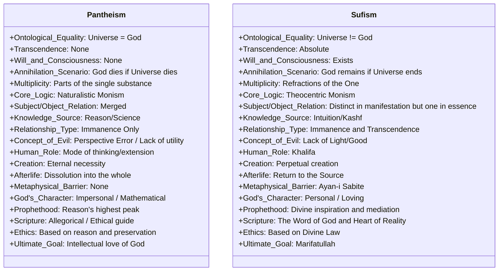

# 09 - Görsel Karşılaştırma Modeli (Mermaid Diagram)

Bu bölümde, Panteizm ve Vahdet-i Vücud (Sufizm) arasındaki temel ontolojik farklar, bir sınıf diyagramı (*Class Diagram*) üzerinden görselleştirilmiştir. Bu model, her iki sistemin "varlık" (vücud) anlayışını nasıl yapılandırdığını net bir şekilde ortaya koyar.

---

## Modelin İzahı

1.  **Bağımsızlık vs. Bağımlılık:** `Sufism` sınıfında `Annihilation_Scenario` parametresinde görüldüğü üzere, Allah'ın varlığı evrene bağlı değildir. `Pantheism` sınıfında ise bu iki kavram ontolojik olarak birbirine mahkumdur.
2.  **Aşkınlık (Transcendence):** Panteizmde aşkınlık sıfırken, Sufizm'de aşkınlık (Tenzih) sistemin kurucu unsurudur.
3.  **İnsan Rolü:** Panteizmde insan "tüzün bir modu" iken, Sufizm'de ilahi isimlerin aynası olan "Halife" makamındadır.

---
*Geri dön: [Ana Sayfa (README)](../README.md)*
