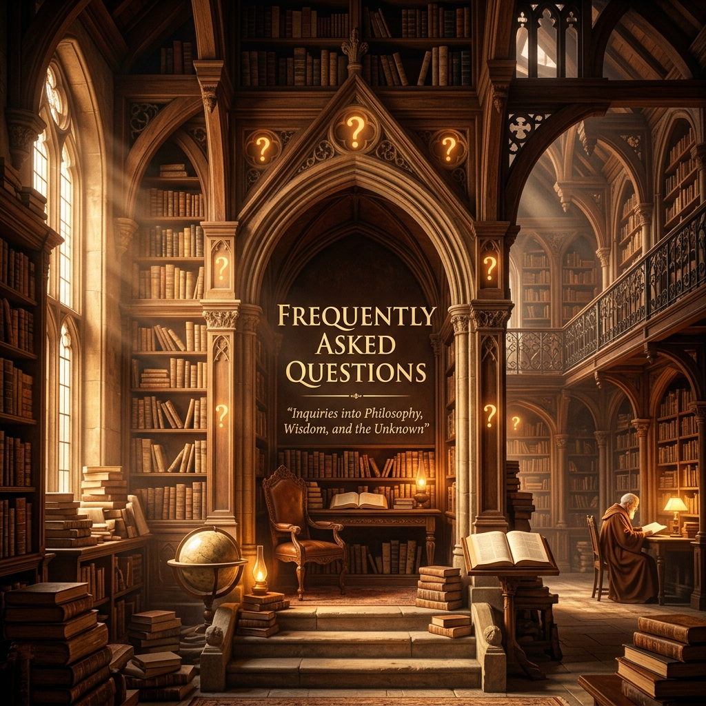

# 10 - Sıkça Sorulan Sorular ve Yanlış Anlaşılmalar (FAQ)

Vahdet-i Vücud meselesi, İslam düşünce tarihinde en çok tartışılan ve yanlış anlaşılmaya en müsait konulardan biridir. Bu bölüm, hem avam hem de bazı havas katmanlarında oluşan kafa karışıklıklarını gidermeyi hedefler.

## 1. Vahdet-i Vücud, Panteizm (Kamu-Tanrıcılık) midir?
**Hayır.** Panteizmde Tanrı ve Evren ontolojik olarak bir ve aynıdır (Tanrı = Evren). Vahdet-i Vücud'da ise Allah (C.C.) Zat'ı itibariyle evrenden münezzehtir (Aşkındır). Evren sadece O'nun isim ve sıfatlarının bir tecellisidir (yansımasıdır). Panteizmde evren yok olsa Tanrı da yok olur; Vahdet-i Vücud'da ise evren yok olsa da Allah'ın kemalinden hiçbir şey eksilmez.

## 2. Vahdet-i Vücud "Hulul" (Tanrı'nın bir şeye girmesi) midir?
**Kesinlikle hayır.** Hulul, iki ayrı varlığın birbiri içine girmesini gerektirir (Örn: Suyun süngere girmesi). Vahdet-i Vücud'da ise "iki ayrı hakiki varlık" yoktur ki biri diğerine girsin. Hakiki varlık tektir, geri kalan her şey o varlığın gölgesidir. Sufiler, Hulul fikrini küfür ve dalalet olarak görürler.

## 3. Vahdet-i Vücud "İttihat" (Tanrı ile birleşmek) midir?
**Hayır.** İttihat, iki ayrı varlığın sonradan birleşerek tek olmasıdır. Vahdet-i Vücud'da kul hiçbir zaman Allah olmaz. Kul, kendi "yokluğunu" ve "gölge varlık" olduğunu idrak eder. Damla denize düştüğünde deniz olmaz, damla olduğunu unutur veya denizde fani olur; ama deniz hep denizdir.

## 4. "Enel Hak" (Ben Hakk'ım) demek şirke girer mi?
Hallac-ı Mansur gibi zatların söylediği bu sözler, "sekran" (manevi sarhoşluk) ve "fena" makamında söylenmiş sözlerdir. Bu söz "Ben Allah'ım" demek değil, "Bende benden bir eser kalmadı, her zerremde O'nun tecellisi var, ben aradan çekildim" demektir. Ancak bu tür sözlerin şeriat zahirine aykırı düşmemesi için ulu orta söylenmesi caiz görülmemiştir.

## 5. Her şey Allah ise, pislik ve şer olan şeyler nedir?
Vahdet-i Vücud'a göre her şey O'nun isimlerinin tecellisidir; ancak bu tecelliler mertebe mertebedir. Nurun azalması karanlığı, hayrın azalması şerri doğurur. Bir aynanın arkasındaki siyahlık (sır), görüntünün oluşması için lazımdır. Şer ve çirkinlik, eşyanın kendisinde değil, bizim bakış açımızda veya ilahi hikmetin o noktadaki perdeli oluşundadır.

## 6. Bu inanç Şeriatı ve ibadeti düşürür mü?
**Asla.** Vahdet-i Vücud'un en büyük temsilcileri (İbn Arabi, Mevlana, Gazali vb.) şeriata en sıkı bağlı olan zatlardır. Onlara göre "Hakikat, Şeriatın özüdür". Şeriatı terk eden, Vahdet-i Vücud davasında yalancıdır. İbadet, kulun kendi acziyetini ve Allah'ın azametini idrak etme makamıdır.

---

> **Önemli Kaide:** "Eşyanın hakikatleri sabittir." (Nesefi Akaidi). Vahdet-i Vücud ehli, eşyanın "varlık" bakımından Hak ile kaim olduğunu söylerken, "mahiyet" ve "hüküm" bakımından eşyanın farklılığını (kulun kul, Rabb'in Rab oluşunu) her zaman muhafaza ederler.

---
*Sonraki Bölüm: [11_methodology_kashf_vs_reason.md](11_methodology_kashf_vs_reason.md)*
